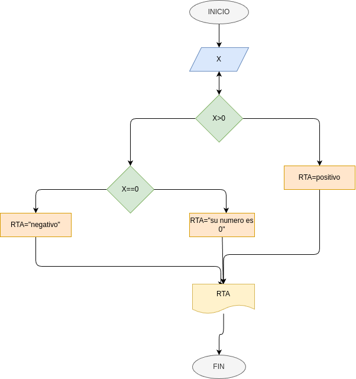
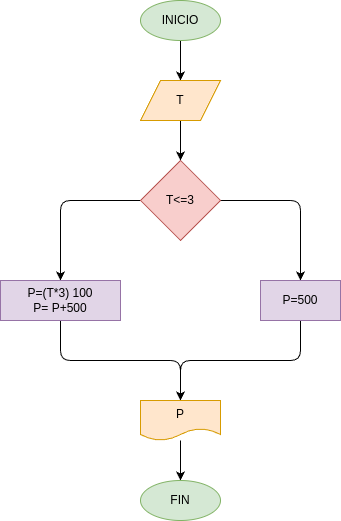
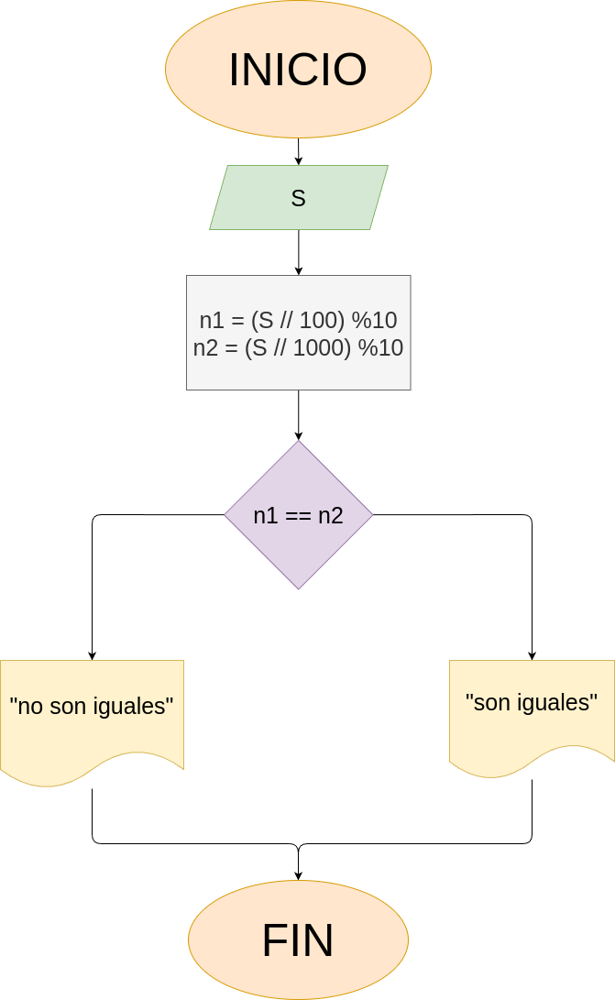

# Taller_condicionales
Trabajo de repositorio con diferentes ejercicios
- 1-Determinar si un numero es positivo o negativo
- 2-Costo de una llamada
- 3-Numero entero par o impar
- 4-Ultimos 2 digitos iguales
- 5-Numero mayor entre tres
- 6-Precio de ganancia de un producto de una tienda 
## Diagrama de flujo de los ejercicios

### Ejercicio #1

### Ejercicio #2

### Ejercicio #3

### Ejercicio #4

### Ejercicio #5

### Ejercicio #6
