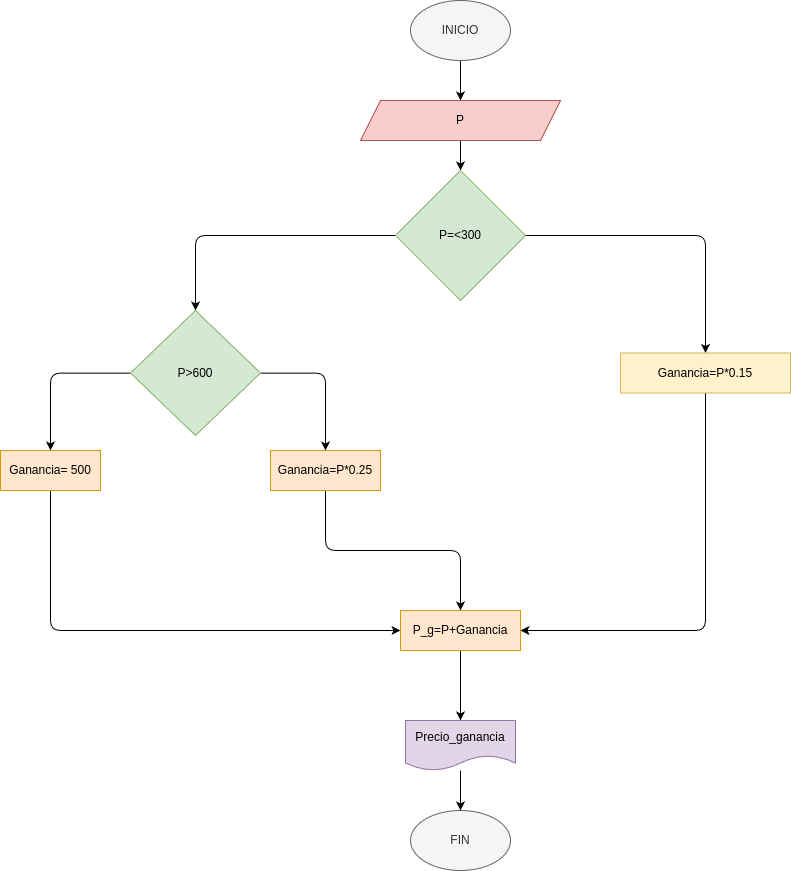

# Ejercicio #6
- El dueño de una papeleria desea un programa que  le indique el precio de venta de un articulo dado, el precio se calcula con la siguiente formula

#### Importante
- el valor minimo que se puede ingresar es de 1000
## Formulas 
- Pg=precio+Ganancia
- Ganancia=P*0.15
## Funcionamiento
- el programa es capas de decidir que, la ganancia es del 15% si el preciodel productoes inferior o igual a 3000, si el precio esta entre 3000 y 6000 se le sumara 500 al precio inicial, la ganancia sera del 25% del valor del producto si el precio es mayor a 6000
## Diagrama de flujo 
